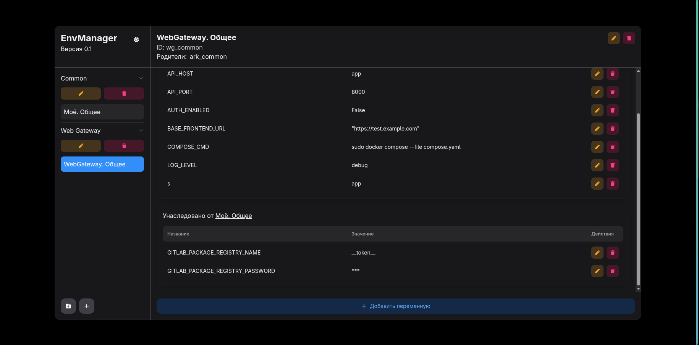

# EnvManager - менеджер переменных окружения

EnvManager - это простой инструмент для управления переменными окружения в различных проектах. С его помощью вы можете легко создавать, редактировать и удалять переменные окружения, а также переключаться между различными конфигурациями.

## Возможности
- Проекты - содержит переменные среды для конкретного проекта.
- Группы - объединяйте проекты в группы для удобного управления.
- Наследование проектов - проекты могут наследовать переменные из других проектов, что позволяет гибко настраивать окружение.
- CLI-утилита для генерации .env файла.
- Веб-интерфейс для управления переменными окружения.


## Принцип работы
Поднимаются несколько контейнеров:
- Веб-интерфейс для управления переменными окружения. [клик](https://github.com/Finder42Lab/EnvManagerFrontend)
- Backend-сервис для обработки запросов от веб-интерфейса и взаимодействия с базой данных. [клик](https://github.com/Finder42Lab/EnvManagerBackend)
- База данных для хранения переменных окружения.
- [CLI](https://github.com/Finder42Lab/EnvManagerCLI) утилита так же может взаимодействовать с Backend-сервисом для управления переменными окружения из командной строки.
 
Все запросы идет на Backend-сервис, который обрабатывает их и взаимодействует с базой данных для хранения и извлечения переменных окружения. При желании можно подключиться к облачной БД (Postgres) и синхронизировать переменные между устройствами.

По умолчанию api доступен по адресу http://localhost:8420, а веб-интерфейс по адресу http://localhost:8421. Порты так же можно изменить в файле .env. В этом случае для CLI-утилиты необходимо установить параметр EMN_HOST равным новому адресу api.


## Установка
- клонировать репозиторий:
```bash
git clone https://github.com/Finder42Lab/EnvManager
```
- Выполнить команду сборки:
```bash
make build
```
ИЛИ
```bash
docker compose -f compose.yaml --env-file ./.env build
```
- Запустить приложение:
```bash
make start
```
ИЛИ
```bash
docker compose -f compose.yaml --env-file ./.env up -d
```
- Открыть веб-интерфейс по адресу http://localhost:8421
- Установить CLI-утилиту. Скачать последнюю версию с [релизов](https://github.com/Finder42Lab/EnvManagerCLI/releases)
- Добавить в переменные окружения путь к утилите. Выдать права на исполнение